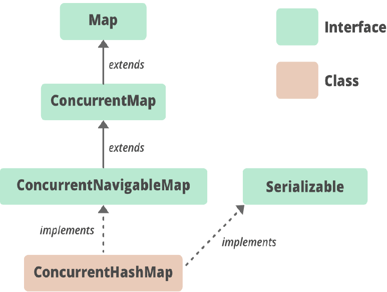
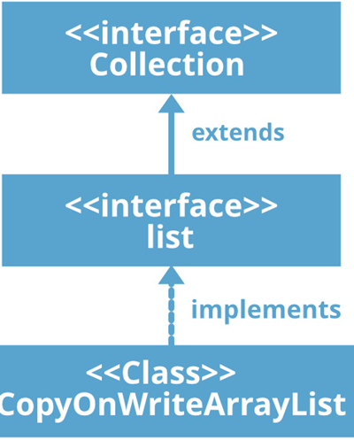

# Concurrent Collections in Java

## Need for Concurrent Collections

1. Traditional Collection Objects (like `ArrayList`, `HashMap`, etc.) can be accessed by multiple threads simultaneously, leading to potential data inconsistency problems, making them not thread-safe.
2. Existing thread-safe collections (`Vector`, `Hashtable`, `synchronizedList()`, `synchronizedSet()`, `synchronizedMap()`) do not perform well enough.
3. Because for every operation, even for read operations, the entire collection will be locked by only one thread at a time, increasing the waiting time of threads.

### Issues with Traditional Collections

1. Another big problem with traditional collections is that while one thread is iterating over the collection, other threads are not allowed to modify the collection object simultaneously. If modification is attempted, a `ConcurrentModificationException` is thrown.
2. Hence, these traditional collection objects are not suitable for scalable multi-threaded applications.
3. To overcome these problems, SUN introduced concurrent collections in Java 1.5.

## Differences Between Traditional & Concurrent Collections

1. Concurrent Collections are always thread-safe.
2. When compared with traditional thread-safe collections, performance is improved due to different locking mechanisms.
3. While one thread is interacting with the collection, other threads are allowed to modify the collection in a safe manner.

Hence, Concurrent Collections never throw `ConcurrentModificationException`.

### Important Concurrent Classes

1. `ConcurrentHashMap`
2. `CopyOnWriteArrayList`
3. `CopyOnWriteArraySet`

## ConcurrentMap(I)

### Methods

1. `Object putIfAbsent(Object key, Object value)`: To Add Entry to the Map If the specified Key is Not Already Available

| put()                                                                                            | putIfAbsent()                                                                                                                                               |
|--------------------------------------------------------------------------------------------------|-------------------------------------------------------------------------------------------------------------------------------------------------------------|
| If the key is Already Available, Old Value will  be replaced with New Value  and Returns Old Value | If the key is already present then entry wont be added and returns old associated value. If the key is not available then only entry will be added. |

2. `boolean remove(Object key, Object value)` :  Removes the Entry if Key Associated with specified Value only
3. `boolean replace(Object key,Object oldValue, Object newValue)` : If Key Value Matched then Replace with newValue

## CopyOnWriteArrayList(C)

## Overview
`CopyOnWriteArrayList` is a thread-safe variant of `ArrayList` in Java. It implements the `List` interface and inherits from the `Collection` interface.

## Key Characteristics
- **Thread Safety**: As the name suggests, `CopyOnWriteArrayList` ensures thread safety. This means it can be safely used in a multi-threaded environment without requiring additional synchronization.
- **Copy-On-Write Mechanism**: For every update operation (add, set, etc.), a cloned copy of the underlying `ArrayList` is created. This helps in maintaining thread safety while performing update operations.
- **Synchronization**: Both the original and cloned `ArrayList` are synchronized automatically by the JVM, ensuring data consistency and integrity.

## Usage
`CopyOnWriteArrayList` is particularly useful in scenarios where read operations are more frequent than write operations. Since the `CopyOnWriteArrayList` creates a new copy of the array with each write operation, it can be less efficient for scenarios with frequent writes but provides excellent performance for scenarios with many reads and few writes.

    